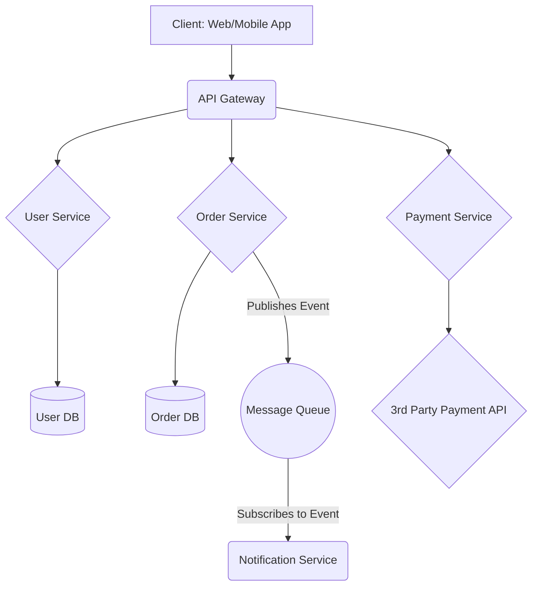

### Lead Full-Stack Architect & Creative Technologist

I am a seasoned architect and engineer with over a decade of experience in building everything from scalable enterprise applications to cutting-edge blockchain solutions. My passion lies at the intersection of robust backend engineering, elegant UI/UX, and innovative technologies. I thrive on solving complex problems and transforming ideas into high-quality, production-ready software.

My philosophy is simple: build clean, resilient systems that humans love to use.

---

### 🔭 Current Focus & Interests

* **Architecting Resilient Systems:** Designing microservices and distributed systems with a focus on performance and scalability.
* **Web3 & Blockchain:** Exploring decentralized finance (DeFi), NFTs, and developing smart contracts with Solidity and Rust.
* **Data Science & AI:** Currently deepening my expertise in Data Science and Machine Learning to build more intelligent applications.
* **Mentorship:** Advocating for clean code principles and sharing my journey to help grow the next generation of developers.
* **🌱 I’m currently learning:** Advanced concepts in Kubernetes and system design.
* **💡 I’m currently working on:** A decentralized identity management system using Rust.

---

### 📜 My Core Principles

* **Simplicity Over Complexity:** I architect systems that are easy to understand and maintain.
* **Automate Everything:** Repetitive tasks should be handled by machines, freeing humans to solve creative problems.
* **Pragmatism First:** I choose the right tool for the job, not just the most popular one.
* **Ownership & Accountability:** Teams thrive when they have the autonomy and responsibility to own their work.

---

### 🏛️ Sample System Architecture

Here's a high-level overview of a typical microservices architecture I design. This diagram is rendered directly from code using Mermaid.js.

---

### 💻 Core Technologies & Tools

My toolbox is extensive. Here’s a snapshot of the technologies I command, categorized by domain:

<h4 align="center">Frontend Development</h4>

  
  
  
  
  
  
  
  

<h4 align="center">Backend Development</h4>

  
  
  
  
  
  
  
  

<h4 align="center">Mobile Development</h4>

  
  
  

<h4 align="center">Databases & BaaS</h4>

  
  
  
  
  

<h4 align="center">DevOps & Cloud Infrastructure</h4>

  
  
  
  
  

<h4 align="center">Blockchain & Data Science</h4>

  
  
  
  

---

### 📊 My GitHub Stats

---

### 📫 Let's Connect

  
  
  

